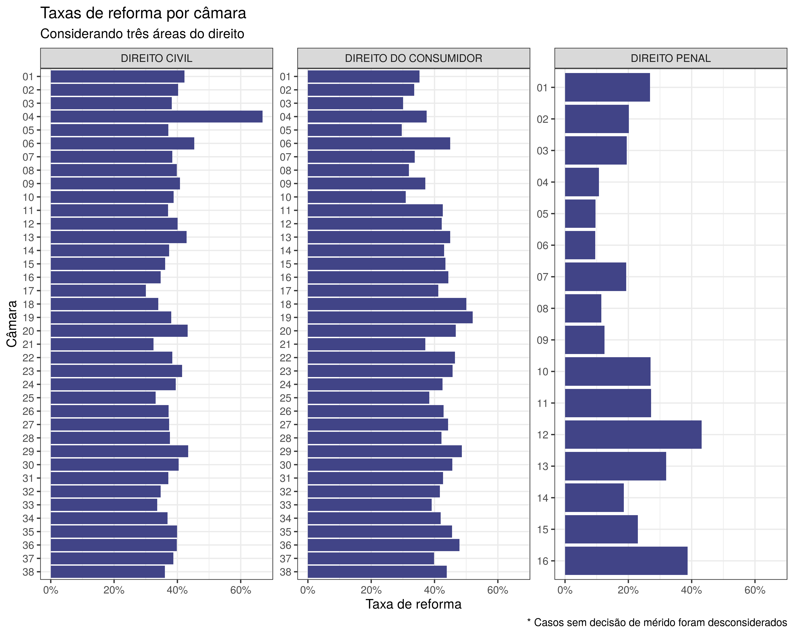

<!-- README.md is generated from README.Rmd. Please edit that file -->

# tjsp2inst

<!-- badges: start -->

<!-- badges: end -->

Base de jurisprudência do TJSP. No momento, contém os dados da
jurisprudência de 2020. A listagem de processos foi feita utilizando-se
a [Consulta de Julgados de Segundo Grau
(CJSG)](https://esaj.tjsp.jus.br/cjsg/resultadoCompleta.do). Os
processos foram baixados utilizando-se a [Consulta de Processos de
Segundo Grau (CPOSG)](https://esaj.tjsp.jus.br/cposg/open.do). A
ferramenta utilizada para extração dos arquivos brutos e leitura em
bases organizadas foi o `{lex}`, pacote desenvolvido pela Terranova.

A base exportada foi construída a partir dos dados do CPOSG. os dados do
CJSG foram utilizados somente para listagem dos processos. Os arquivos
brutos (CPOSG e CJSG), salvos em binários `.rds`, não estão disponíveis
no repositório, mas podem ser acessadas caso necessário. Os scripts
presentes na pasta `data-raw` contêm o passo-a-passo para obtenção de
todos os dados.

## Colunas da base de dados

Abaixo segue um resumo simples da base

``` r
dplyr::glimpse(tjsp2inst::tjsp2inst)
#> Rows: 612,517
#> Columns: 14
#> $ id_processo       <chr> "00000312719868260320", "00000677420138260368", "00…
#> $ info_area         <fct> Cível, Cível, Criminal, Criminal, Criminal, Crimina…
#> $ info_classe       <fct> Apelação Cível, Apelação Cível, Recurso em Sentido …
#> $ info_assunto_full <chr> "DIREITO ADMINISTRATIVO E OUTRAS MATÉRIAS DE DIREIT…
#> $ info_assunto_pai  <fct> DIREITO ADMINISTRATIVO E OUTRAS MATÉRIAS DE DIREITO…
#> $ info_camara_num   <fct> 12, 14, 12, 03, 03, 16, 11, 15, 16, 06, 03, 03, 03,…
#> $ info_relator      <fct> J. M. RIBEIRO DE PAULA, MELO COLOMBI, VICO MANAS, A…
#> $ info_comarca      <fct> LIMEIRA, MONTE ALTO, CAMPINAS, GUARULHOS, RIO CLARO…
#> $ info_valor        <dbl> 1966.71, 5807.88, NA, NA, NA, NA, 7494.84, 10874.31…
#> $ part_tipo_litigio <fct> nPF-nPF, nPF-PF, PF-nPF, PF-nPF, PF-nPF, PF-nPF, PF…
#> $ dec_val           <fct> Reformou, Não reformou, Parcial, Não reformou, Não …
#> $ dec_unanime       <fct> Unânime, Unânime, Unânime, Unânime, Unânime, Unânim…
#> $ dec_date          <date> 2014-12-01, 2020-01-07, 2020-01-10, 2020-01-13, 20…
#> $ tempo             <int> 965, 1971, 67, 397, 49, 126, 537, 355, 84, 47, 125,…
```

## Exemplo simples

``` r
library(magrittr)

tjsp2inst::tjsp2inst %>% 
  dplyr::filter(dec_val %in% c("Não reformou", "Parcial", "Reformou")) %>% 
  dplyr::group_by(info_assunto_pai) %>% 
  dplyr::filter(dplyr::n() > 1e5) %>% 
  dplyr::group_by(info_assunto_pai, info_camara_num) %>% 
  dplyr::filter(dplyr::n() > 1e2) %>% 
  dplyr::summarise(
    prop_reforma = mean(!dec_val %in% "Não reformou"), 
    .groups = "drop"
  ) %>% 
  ggplot2::ggplot() +
  ggplot2::aes(prop_reforma, forcats::fct_rev(info_camara_num)) +
  ggplot2::geom_col(fill = viridis::viridis(1, 1, .2, .8)) +
  ggplot2::facet_wrap(~info_assunto_pai, ncol = 3, scales = "free_y") +
  ggplot2::scale_x_continuous(labels = scales::percent) +
  ggplot2::theme_bw(12) +
  ggplot2::labs(
    x = "Taxa de reforma", 
    y = "Câmara", 
    title = "Taxas de reforma por câmara",
    subtitle = "Considerando três áreas do direito", 
    caption = "* Casos sem decisão de mérito foram desconsiderados"
  )
```


